Resistance Is Futile: Anti-Trump Demonstrations and their Effect on
Legislation
================
Mac Bagwell
2020-03-11

  - [Introduction](#introduction)
  - [Data](#data)
      - [Trump Score](#trump-score)
      - [Protests](#protests)
  - [Analysis](#analysis)
      - [The Long Term](#the-long-term)
      - [The Short Term](#the-short-term)
  - [Conclusion](#conclusion)
      - [Footnotes](#footnotes)

``` r
library(tidyverse)
library(lubridate)
library(modelr)

START <- "2017-02-02"
END <- "2018-12-31"

LAMBDA <- 0.95
WINDOW <- 90

file_protests_population <- here::here("data/protests_population.rds")
file_member_averages <- here::here("data/member_averages.rds")
file_votes <- here::here("data/votes.rds")
file_class <- here::here("data/senate-class.rds")

#===============================================================================

# Code
ewma <- function(x, lambda, init = median(x, na.rm = TRUE)) {
    p <- init
  if_else(!is.finite(x), 0, x) %>% 
      map_dbl(~ (p <<- p * lambda + (.) * (1 - lambda)))
}

# Aggregate data
protests_population <- 
  file_protests_population %>% 
  read_rds() %>% 
  filter(pro_anti_trump == "anti")

member_averages <- 
  file_member_averages %>% 
  read_rds() %>% 
  filter(congress == 115, party != "Independent", votes > 75) %>% 
  left_join(
    file_class %>% 
      read_rds(),
    by = c("last_name", "state")
  )

votes <- 
  file_votes %>% 
  read_rds() 

# Time series data
state_protests_ts <- 
  tibble(date = seq(ymd(START), ymd(END), by = "1 day")) %>% 
  left_join(
    protests_population %>% 
      count(
        state, 
        date = floor_date(date, unit = "day"), 
        wt =  attendance / (population / 1e5),
        name = "protest_activity"
      ) %>% 
      pivot_wider(
        names_from = state,
        values_from = protest_activity,
        values_fill = list(protest_activity = 0L)
      ),
    by = "date"
  ) %>% 
  mutate_at(
    vars(-date),
    ewma,
    lambda = LAMBDA
  ) %>%
  pivot_longer(
    cols = -date,
    names_to = "state",
    values_to = "protest_attendance"
  )

trump_score_ts <- 
  tibble(date = seq(ymd(START), ymd(END), by = "1 day")) %>% 
  left_join(
    votes %>% 
      semi_join(
        member_averages %>% 
          filter(congress == 115L, votes >= 80, party != "Independent"),
        by = "bioguide"
      ) %>% 
      mutate(date = as_date(voted_at)) %>% 
      group_by(date, bioguide, last_name, state, party) %>% 
      summarize(
        agrees = sum(agree),
        votes = n()
      ) %>% 
      pivot_wider(
        names_from = c(bioguide, last_name, state, party),
        values_from = c(agrees, votes)
      ),
    by = "date"
  ) %>% 
  replace_na(list(agrees = 0L, votes = 0L)) %>% 
  mutate_at(
    vars(
      starts_with("agrees"), 
      starts_with("votes")
    ),
    list(
      forward = 
        ~ RcppRoll::roll_suml(., n = WINDOW, fill = NA_integer_, na.rm = TRUE),
      past = 
        ~ lag(.) %>% 
          RcppRoll::roll_sumr(., n = WINDOW, fill = NA_integer_, na.rm = TRUE)
    )
  ) %>% 
  select(date, ends_with("forward"), ends_with("past")) %>% 
  pivot_longer(
    cols = -date,
    names_to = c("variable", "bioguide", "last_name", "state", "party", "window"),
    names_sep = "_",
    values_to = "value"
  ) %>% 
  pivot_wider(
    names_from = c(variable, window),
    values_from = value
  ) %>%
  mutate(
    trump_score_forward = agrees_forward / votes_forward,
    trump_score_past = agrees_past / votes_past,
    trump_score_diff = trump_score_forward - trump_score_past,
  ) %>% 
  group_by(date, party) %>% 
  mutate(trump_score_party_index = percent_rank(trump_score_diff))
```

## Introduction

The first two years of the Trump presidency was marked by extremely high
levels of political activism. According the the Crowd Counting
Consortium, from February 2017 to December 2018, there were more than
16,500 distinct protests with a total attendance of over 7.5 million
people, which is more than 2% of the US population. Most of these
protests were aimed at Donald Trump’s agenda. Nearly 55% of all protests
in the US, accounting for 72% of total protest attendance, had an
anti-Trump message in the years 2017 and 2018.

The theory of the case for this explosion of protests is typically that
they work to galvanize Democrats’ legislative resistance to the
president’s agenda, particularly in the Senate. \[1\] Some in academia
have concluded that public demonstrations have succeeded in doing this.
\[2\] We are going to put that theory to the test ourselves.

## Data

### Trump Score

FiveThirtyEight tracks a figure that they call “Trump Score”. Trump
Score is defined for a congressperson as the percentage of all that
senator’s roll-call votes that are in favor of a bill that Trump
supports or against a bill that he opposes. Naturally, we expect this
number to be lower among legislators exhibiting increased resistance to
the Trump agenda. We will use this as a measure of this resistance. For
our purposes, we will focus only on senators during the 115th Congress
(2017-18) that did not end their term abnormally. For example, we
exclude Jeff Sessions from our analysis, who left the Senate to become
Attorney General, as well as the senators that took his place.

FiveThirtyEight also provides vote-level data for each roll-call vote
used to compute the Trump score. This makes it possible to track how
Trump scores evolve over time for each senator.

Here is a sample of rows from the aggregated table:

``` r
member_averages %>% 
  head() %>% 
  knitr::kable()
```

| congress | chamber | bioguide | last\_name | state | party      | votes | agree\_pct | predicted\_agree | net\_trump\_vote | class |
| -------: | :------ | :------- | :--------- | :---- | :--------- | ----: | ---------: | ---------------: | ---------------: | ----: |
|      115 | senate  | A000360  | Alexander  | TN    | Republican |    80 |  0.9375000 |        0.8795920 |       26.0057009 |     2 |
|      115 | senate  | B000575  | Blunt      | MO    | Republican |    84 |  0.9642857 |        0.8299707 |       18.6371170 |     3 |
|      115 | senate  | B000944  | Brown      | OH    | Democrat   |    83 |  0.3012048 |        0.6900453 |        8.1295744 |     1 |
|      115 | senate  | B001135  | Burr       | NC    | Republican |    81 |  0.9259259 |        0.6033788 |        3.6552285 |     3 |
|      115 | senate  | B001230  | Baldwin    | WI    | Democrat   |    83 |  0.2530120 |        0.5596565 |        0.7643432 |     1 |
|      115 | senate  | B001236  | Boozman    | AR    | Republican |    84 |  0.9642857 |        0.8874494 |       26.9209780 |     3 |

And from the detailed table:

``` r
votes %>% 
  head() %>% 
  knitr::kable()
```

| congress | bill\_id     | roll\_id | chamber | voted\_at           | bioguide | vote | trump\_position | last\_name | state | party    | agree | predicted\_probability |
| -------: | :----------- | :------- | :------ | :------------------ | :------- | :--- | :-------------: | :--------- | :---- | :------- | ----: | ---------------------: |
|      115 | sconres3-115 | s26-2017 | senate  | 2017-01-12 01:05:00 | B001230  | No   |     support     | Baldwin    | WI    | Democrat |     0 |              0.3889182 |
|      115 | sconres3-115 | s26-2017 | senate  | 2017-01-12 01:05:00 | B001267  | No   |     support     | Bennet     | CO    | Democrat |     0 |              0.2719577 |
|      115 | sconres3-115 | s26-2017 | senate  | 2017-01-12 01:05:00 | B001277  | No   |     support     | Blumenthal | CT    | Democrat |     0 |              0.1341125 |
|      115 | sconres3-115 | s26-2017 | senate  | 2017-01-12 01:05:00 | B001288  | No   |     support     | Booker     | NJ    | Democrat |     0 |              0.1284608 |
|      115 | sconres3-115 | s26-2017 | senate  | 2017-01-12 01:05:00 | B000944  | No   |     support     | Brown      | OH    | Democrat |     0 |              0.5555623 |
|      115 | sconres3-115 | s26-2017 | senate  | 2017-01-12 01:05:00 | C000127  | No   |     support     | Cantwell   | WA    | Democrat |     0 |              0.1126540 |

### Protests

The Crowd Counting Consortium collects and publishes data on protests
that occured in the United States since February 2017, sourced largely
on from coverage. They label every protest with the date of the protest,
state in which it happened, an estimate of the number of people in
attendance \[3\], and whether the protest was pro-Trump in messaging,
anti-Trump in messaging, or neither. For our analysis, we only consider
anti-Trump protests with attendance estimates present in the data,
though it is worth noting that about a third of crowd estimates are
missing across all sentiments (see table below).

| Sentiment  | % Missing Attendance Estimates |
| :--------- | :----------------------------- |
| Anti-Trump | 33.29%                         |

Here is a sample of rows from the relevant table:

``` r
protests_population %>% 
  head(10) %>% 
  knitr::kable()
```

| state | date       | pro\_anti\_trump | attendance | population |
| :---- | :--------- | :--------------- | ---------: | ---------: |
| CA    | 2017-02-01 | anti             |        150 |   39148760 |
| CA    | 2017-02-01 | anti             |        125 |   39148760 |
| CT    | 2017-02-01 | anti             |        250 |    3581504 |
| CT    | 2017-02-01 | anti             |       1150 |    3581504 |
| DE    | 2017-02-01 | anti             |         37 |     949495 |
| DE    | 2017-02-01 | anti             |         40 |     949495 |
| HI    | 2017-02-01 | anti             |         NA |    1422029 |
| KS    | 2017-02-01 | anti             |        125 |    2908776 |
| MA    | 2017-02-01 | anti             |        200 |    6830193 |
| MA    | 2017-02-01 | anti             |        200 |    6830193 |

## Analysis

We take two different approaches to this analysis.

  - First, we examine Trump scores and protest activity by state on
    aggregate through the 115th Congress to determine if there are any
    relationships between the two in the *long term*.
  - Second, we examine changes in a windowed Trump score over time and a
    moving average of protest activity by state to see if there are any
    point-in-time effects in the *short term*.

### The Long Term

A natural thing to do if we want to discern a relationship between Trump
Score and protests would be to plot the Trump score of each senator
against the intensity of protests in their state, measured by total
protest attendance per 100,000 people, in years 2017 and 2018. We obtain
the following:

``` r
protests_population %>% 
  count(
    state, 
    name = "protest_activity", 
    wt = attendance / (population / 1e5)
  ) %>% 
  left_join(member_averages, by = "state") %>% 
  ggplot(aes(protest_activity, agree_pct, fill = party)) +
  geom_smooth(aes(color = party), method = "lm", formula = y ~ log(x)) +
  geom_point(shape = 21, color = "black") +
  scale_color_manual(
    breaks = c("Republican", "Democrat"),
    values = c(Republican = "red3", Democrat = "royalblue"),
    aesthetics = c("color", "fill")
  ) +
  scale_x_log10(
    breaks = scales::breaks_log(n = 10)
  ) +
  scale_y_continuous(
    labels = scales::label_percent()
  ) +
  coord_fixed(ratio = 1.5) +
  theme(legend.position = "bottom") +
  labs(
    title = "Senator Trump Score vs. State Protest Activity, 115th Congress",
    subtitle = "Independents omitted",
    caption = "Sources: FiveThirtyEight, Crowd Counting Consortium, ACS 2017",
    x = "Protest Attendance per 100,000 People, Feb. 2017 - Dec. 2018",
    y = "Trump Score",
    color = NULL,
    fill = NULL
  )
```

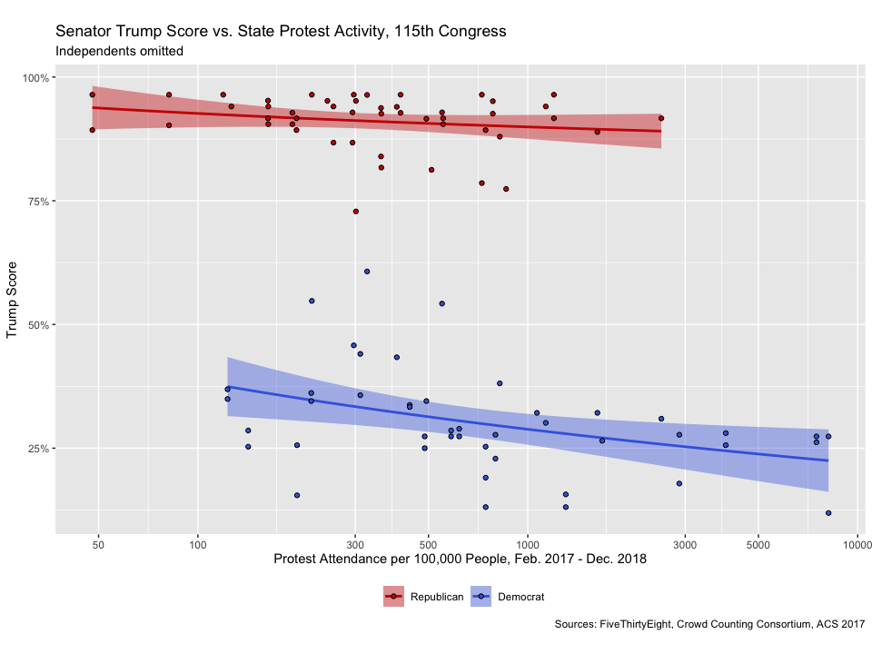<!-- -->

This certainly seems dispositive at first glance; we observe a pretty
large gap between the Republicans and Democrats, but controlling for
party, it seems like protest attendance has a small but noticeable
effect on senators’ Trump scores. However, this ignores an obvious
latent variable that could correlate both with Trump score and protest
attendance: Trump’s favorability by state.

The plots below that Trump’s performance in each state has a sizeable
impact both on senators’ Trump scores and on protest attendance.

``` r
protest_trump_state <- 
  protests_population %>% 
  count(state, name = "protest_level", wt = attendance / (population / 1e5)) %>% 
  left_join(member_averages, by = "state")

protest_trump_state %>% 
  ggplot(aes(net_trump_vote, protest_level)) +
  geom_vline(xintercept = 0, color = "white", size = 1.5) +
  geom_smooth(method = "lm") +
  geom_text(aes(label = state)) +
  scale_x_continuous(labels = scales::label_percent(scale = 1)) +
  scale_y_log10(breaks = scales::breaks_log(n = 9)) +
  labs(
    title = "Protest Attendance per 100,000 people vs. Net Trump Vote",
    subtitle = "States that favored Trump are less active",
    caption = "Sources: FiveThirtyEight, Crowd Counting Consortium, ACS 2017",
    x = "Trump's Margin of Victory, 2016",
    y = "Protest Attendance per 100,000 people, Feb. 2017 - Dec. 2018"
  )
```

    ## `geom_smooth()` using formula 'y ~ x'

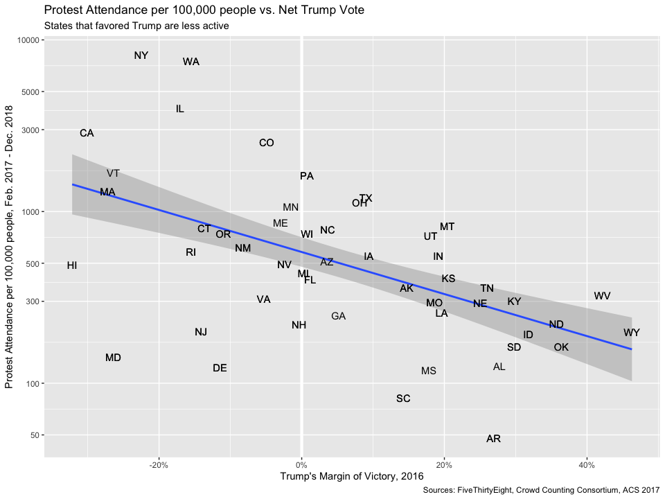<!-- -->

``` r
member_averages %>% 
  ggplot(aes(net_trump_vote, agree_pct)) +
  geom_hline(yintercept = 0.5, size = 1.5, color = "white") +
  geom_vline(xintercept = 0, size = 1.5, color = "white") +
  geom_smooth(aes(color = party), method = "lm") +
  geom_point(aes(fill = party), shape = 21, color = "black") +
  scale_x_continuous(
    breaks = scales::breaks_width(10),
    labels = scales::label_percent(scale = 1)
  ) +
  scale_y_continuous(
    breaks = scales::breaks_width(0.1),
    labels = scales::label_percent(accuracy = 1)
  ) +
  scale_fill_manual(
    breaks = c("Republican", "Democrat"),
    values = c("red3", "royalblue"),
    aesthetics = c("color", "fill")
  ) +
  coord_fixed(ratio = 60) +
  theme(legend.position = "bottom") +
  labs(
    title = "Trump Score vs. State Net Trump Vote",
    subtitle = "States that favored Trump have senators that vote with Trump more often",
    caption = "Sources: FiveThirtyEight",
    x = "State Net Trump Vote (2016)",
    y = "Trump Score",
    color = NULL,
    fill = NULL
  )
```

    ## `geom_smooth()` using formula 'y ~ x'

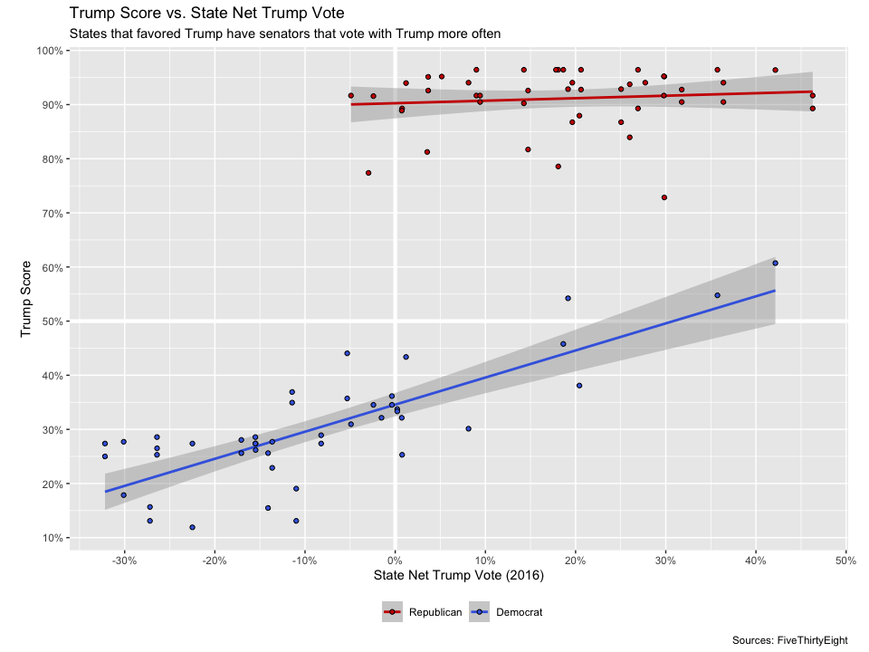<!-- -->

This stands to obfuscate the true effect of protest activity on
senators’ Trump scores; it might be the case that protest attendance
simply serves as a proxy for the only real underlying motivator of Trump
scores which is Trump’s favorability by state. To control for this, we
took the residuals from the linear models shown in the previous two
plots given by

`trump_score = a_0 + a_1 . net_trump_vote + a_2 . party + a_3 .
trump_vote . party`

`protest_attendance = a_0 + a_1 . net_trump_vote`

and plotted them against each other.

``` r
protest_trump_mod <- 
  protest_trump_state %>% 
  fit_with(
    lm, 
    list(
      protest = log(protest_level) ~ net_trump_vote,
      trump = agree_pct ~ net_trump_vote * party
    )
  )

protest_trump_state %>% 
  spread_residuals(!!! protest_trump_mod) %>% 
  ggplot(aes(protest, trump, fill = party)) +
  geom_hline(yintercept = 0, size = 1.5, color = "white") +
  geom_vline(xintercept = 0, size = 1.5, color = "white") +
  geom_point(shape = 21, size = 2, color = "black") +
  scale_fill_manual(
    breaks = c("Republican", "Democrat"),
    values = c(Republican = "red3", Democrat = "royalblue")
  ) +
  scale_y_continuous(
    labels = scales::label_percent()
  ) +
  theme(legend.position = "bottom") +
  labs(
    title = "Residual Trump Score vs. Residual Protest Activity during the 115th Congress",
    subtitle = "Distribution does not suggest residual effects",
    caption = "Variables controlled for Trump's 2016 margin of victory by state\nSources: FiveThirtyEight, Crowd Counting Consortium",
    x = "Residual Log(Protest Activity), Feb. 2017 - Dec. 2018",
    y = "Residual Trump Score",
    fill = NULL
  ) 
```

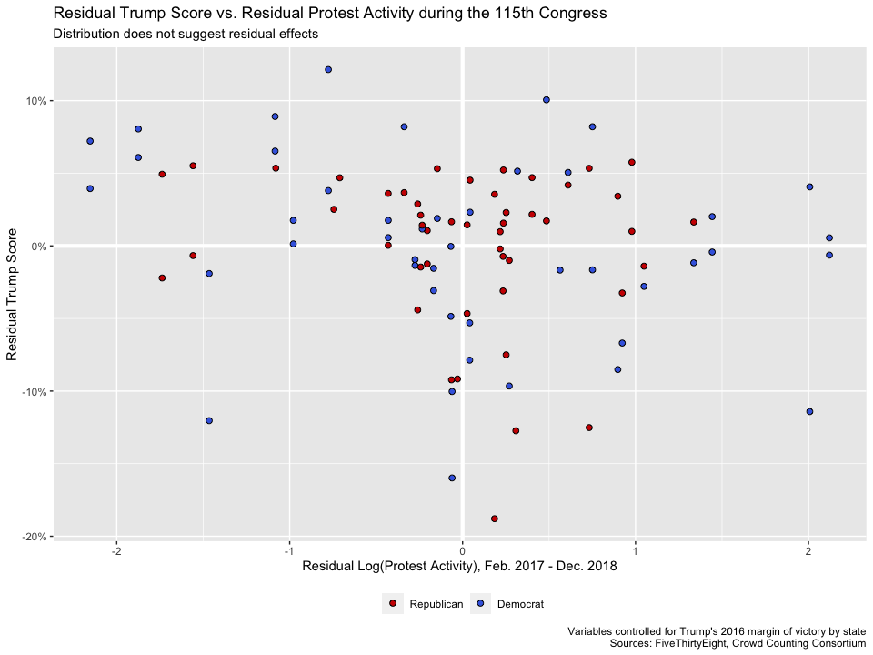<!-- -->

It is clear that no discernible trend exists among these two variables.
This strongly suggests that protest activity does not really move the
needle that much on a senators’ resistance to Trump over long periods of
time.

### The Short Term

While the above analysis shows pretty definitively that there isn’t much
to be gained in the long run from public demonstrations, it might be the
case that bursts of protests temporarily affect senators’ voting
patterns.

To test this model, we need to come up with point-in-time versions of
the protest attendance and Trump score signals, which will allow us to
see how these correlate over time.

To convert Trump score into a time-series statistic, we calculate at
every day for every senator the Trump score of that senator using the
votes over the next 90 days. Below are plots of the distribution of this
signal.

``` r
trump_score_ts %>% 
  drop_na(trump_score_diff) %>% 
  group_by(date) %>% 
  summarize(
    pct_25 = quantile(trump_score_diff, 0.25, na.rm = TRUE),
    pct_50 = quantile(trump_score_diff, 0.5, na.rm = TRUE),
    pct_75 = quantile(trump_score_diff, 0.75, na.rm = TRUE)
  ) %>% 
  ggplot(aes(date)) +
  geom_ribbon(aes(ymin = pct_25, ymax = pct_75), alpha = 0.25) +
  geom_line(aes(y = pct_50), size = 1) +
  geom_hline(yintercept = 0) +
  scale_x_date(
    date_breaks = "2 months",
    date_labels = "%b %y"
  ) +
  scale_y_continuous( 
    breaks = scales::breaks_width(0.1),
    labels = scales::label_percent(accuracy = 1)
  ) +
  scale_fill_manual(
    breaks = c("Republican", "Democrat"),
    values = c(Republican = "red", Democrat = "royalblue"),
    aesthetics = c("color", "fill")
  ) +
  theme(
    axis.text.x = element_text(angle = 45, hjust = 1),
    legend.position = "bottom"
  ) +
  labs(
    title = str_glue("Middle 50% of {WINDOW}D Trump Score Change, 115th Congress"),
    caption = "Source: FiveThirtyEight",
    x = NULL,
    y = "Trump Score",
    fill = NULL,
    color = NULL
  )
```

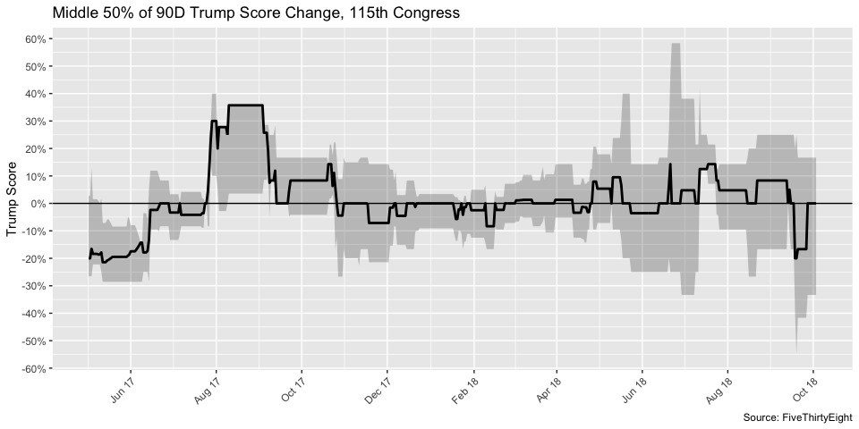<!-- -->

``` r
trump_score_ts %>% 
  drop_na(trump_score_diff) %>% 
  group_by(date, party) %>% 
  summarize(
    pct_25 = quantile(trump_score_diff, 0.25, na.rm = TRUE),
    pct_50 = quantile(trump_score_diff, 0.5, na.rm = TRUE),
    pct_75 = quantile(trump_score_diff, 0.75, na.rm = TRUE)
  ) %>% 
  ggplot(aes(date, color = party, fill = party)) +
  geom_hline(yintercept = 0, color = "white", size = 1.5) +
  geom_ribbon(aes(ymin = pct_25, ymax = pct_75), alpha = 0.25) +
  geom_line(aes(y = pct_50, group = party), size = 1) +
  scale_x_date(
    date_breaks = "2 months",
    date_labels = "%b %y"
  ) +
  scale_y_continuous( 
    breaks = scales::breaks_width(0.1),
    labels = scales::label_percent(accuracy = 1)
  ) +
  scale_fill_manual(
    breaks = c("Republican", "Democrat"),
    values = c(Republican = "red3", Democrat = "royalblue"),
    aesthetics = c("color", "fill")
  ) +
  theme(
    axis.text.x = element_text(angle = 45, hjust = 1),
    legend.position = "bottom"
  ) +
  labs(
    title = str_glue("Middle 50% of {WINDOW}D Trump Score Change by Party, 115th Congress"),
    caption = "Source: FiveThirtyEight",
    x = NULL,
    y = "Trump Score",
    fill = NULL,
    color = NULL
  )
```

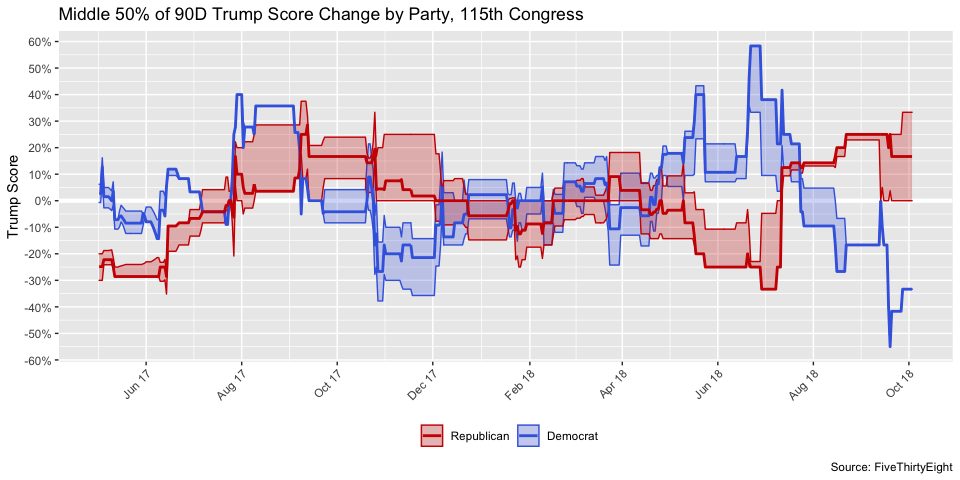<!-- -->

To convert protest attendance into a time-series signal, we take an
exponential moving average of daily protest attendance per 100,000
people. \[4\] To see an illustration of how this moving average works,
below we show the daily national protest attendance and its exponential
moving average.

``` r
protests_population %>% 
  count(date, wt = attendance, name = "attendance") %>% 
  mutate(ewma_attendance = ewma(attendance, lambda = LAMBDA)) %>% 
  ggplot(aes(date)) +
  geom_segment(aes(xend = date, y = 1, yend = 1 + attendance), alpha = 0.5) +
  geom_line(aes(y = 1 + ewma_attendance), color = "red") +
  scale_x_date(date_breaks = "3 months", date_labels = "%b %Y") +
  scale_y_log10(n.breaks = 6, labels = scales::label_number()) + 
  labs(
    title = "National Protest Attendance over Time",
    subtitle = "Red line represents exponential moving average",
    caption = "Source: Crowd Counting Consortium",
    x = NULL,
    y = "National Protest Attendance per 100,000"
  )
```

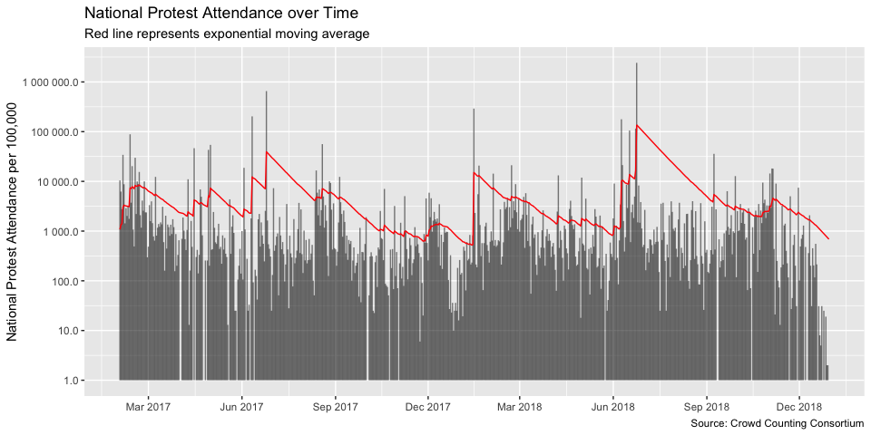<!-- -->

The senator-level statistic we will analyze will be the spearman
correlation coefficient of the following two day-level variables

  - The difference between each senator’s Trump score over the past 90
    days and their Trump score over the next 90 days.
  - The log of the exponential moving average of daily protest
    attendance in each senator’s state. \[5\]

Below is the distribution of the correlation coefficients of all
senators.

``` r
corrs <- 
  state_protests_ts %>% 
  left_join(
    trump_score_ts %>% 
      semi_join(member_averages, by = "bioguide"), 
    by = c("date", "state")
  ) %>% 
  group_by(bioguide) %>% 
  summarize(
    r_diff = 
      cor(
        log(protest_attendance), 
        trump_score_diff, 
        method = "spearman", 
        use = "pair"
      )
  ) %>% 
  left_join(member_averages, by = "bioguide")

corrs %>% 
  ggplot(aes(r_diff, fill = party)) +
  geom_vline(xintercept = 0, color = "grey50", size = 1.5) +
  geom_dotplot(binwidth = 0.02, alpha = 0.8) +
  scale_x_continuous(
    breaks = scales::breaks_width(0.1)
  ) +
  scale_fill_manual(
    breaks = c("Democrat", "Republican"),
    values = c(Democrat = "royalblue", Republican = "red3")
  ) + 
  theme(legend.position = "bottom") +
  labs(
    title = str_glue("Correlation {WINDOW}D Trump Score Change and Protest Activity"),
    subtitle = "Distribution suggests legislators compromise more often following increased protest activity",
    caption = "Spearman method used to compute correlation\nSources: FiveThirtyEight, Crowd Counting Consortium",
    x = "Correlation Coefficient",
    y = NULL,
    fill = NULL
  )
```

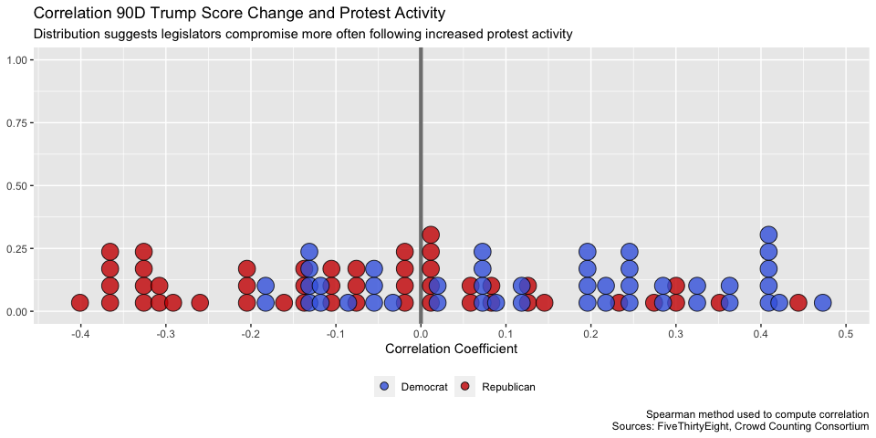<!-- -->

``` r
corrs %>% 
  ggplot(aes(party, r_diff, fill = party)) +
  geom_hline(yintercept = 0, color = "grey50", size = 1.5) +
  geom_boxplot(alpha = 0.8, show.legend = FALSE) +
  scale_y_continuous(
    breaks = scales::breaks_width(0.1)
  ) +
  scale_fill_manual(
    breaks = c("Democrat", "Republican"),
    values = c(Democrat = "royalblue", Republican = "red3")
  ) + 
  coord_flip() +
  theme(legend.position = "bottom") +
  labs(
    title = str_glue("Correlation of {WINDOW}D Trump Score Change and Protest Activity"),
    subtitle = "Distribution suggests legislators compromise more often following increased protest activity",
    caption = "Spearman method used to compute correlation\nSources: FiveThirtyEight, Crowd Counting Consortium",
    x = NULL,
    y = "Correlation Coefficient",
    fill = NULL
  )
```

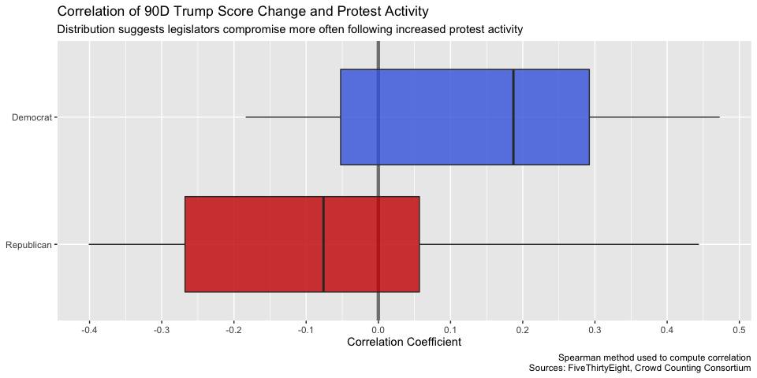<!-- -->

The distribution is pretty surprising. This suggests that legislators
are actually more likely to **compromise** following increased intensity
of public demonstrations.

To put it bluntly, I don’t know why this happens. One explanation I can
think of is that protests could be coming just **after** periods of
intensified resistance in Congress, which could in turn mean that the
protests signal some kind of regression to the mean moreso than they
signal the period of increased resistance. It could also mean that
lawmakers are actually more interested in compromise in the name of
getting something done when they see that their constituents are
unhappy. This is definitely something worth investigating further, but
might require more sophisticated data or knowledge of lawmaking than is
available to me right now.

In any case, I broke this coefficient out by by senatorial class.

``` r
party_medians <- 
  corrs %>% 
  group_by(party) %>% 
  summarize(r_diff = median(r_diff, na.rm = TRUE))

corrs %>% 
  ggplot(aes(r_diff, fill = party)) +
  geom_vline(xintercept = 0, color = "grey50", size = 1.5) +
  geom_vline(
    aes(color = party, xintercept = r_diff), 
    data = party_medians, 
    size = 1.5,
    show.legend = FALSE
  ) +
  geom_dotplot(binwidth = 0.02, alpha = 0.8) +
  geom_text(
    aes(color = party),
    data = party_medians,
    y = Inf,
    hjust = 1.1,
    vjust = 1.7,
    label = "Party Median",
    show.legend = FALSE
  ) +
  scale_x_continuous(
    breaks = scales::breaks_width(0.1)
  ) +
  scale_fill_manual(
    breaks = c("Democrat", "Republican"),
    values = c(Democrat = "royalblue", Republican = "red3"),
    aesthetics = c("color", "fill")
  ) + 
  facet_grid(
    rows = vars(class), 
    labeller = labeller(.rows = function(x) str_c("Class ", x))
  ) +
  theme(legend.position = "bottom") +
  labs(
    title = str_glue("Correlation of {WINDOW}D Trump Score Change and Protest Activity by Senate Class"),
    subtitle = "Class 1 up for re-election in 2018, contains many lawmakers with high correlation coefficients",
    caption = "Spearman method used to compute correlation\nSources: FiveThirtyEight, Crowd Counting Consortium, Wikipedia",
    x = "Correlation Coefficient",
    y = NULL,
    fill = NULL
  ) 
```

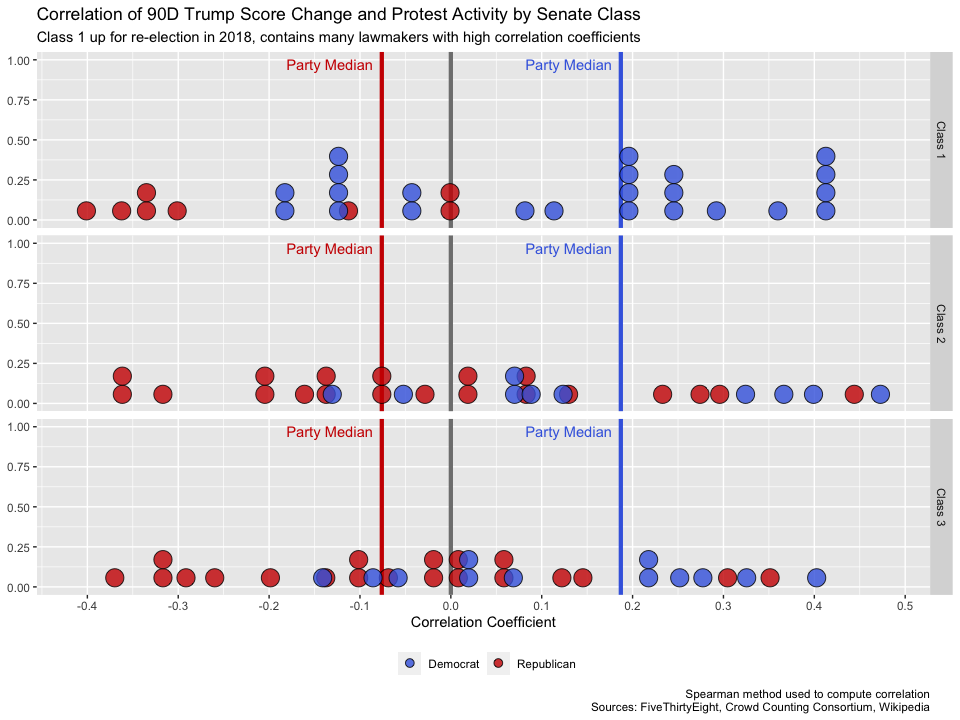<!-- -->

``` r
corrs %>% 
  ggplot(aes(party, r_diff, fill = party)) +
  geom_hline(yintercept = 0, color = "grey50", size = 1.5) +
  geom_hline(
    aes(yintercept = r_diff, color = party), 
    data = party_medians, 
    size = 1.5,
    show.legend = FALSE
  ) +
  geom_boxplot(alpha = 0.8, show.legend = FALSE) +
  geom_text(
    aes(color = party),
    data = party_medians,
    x = Inf,
    hjust = 1.1,
    vjust = 1.7,
    label = "Party Median",
    show.legend = FALSE
  ) +
  scale_x_discrete(expand = c(0.5, 0.2)) +
  scale_y_continuous(
    breaks = scales::breaks_width(0.1)
  ) +
  scale_fill_manual(
    breaks = c("Democrat", "Republican"),
    values = c(Democrat = "royalblue", Republican = "red3"),
    aesthetics = c("color", "fill")
  ) + 
  coord_flip() +
  facet_grid(
    rows = vars(class), 
    labeller = labeller(.rows = function(x) str_c("Class ", x))
  ) +
  theme(legend.position = "bottom") +
  labs(
    title = str_glue("Correlation of {WINDOW}D Trump Score Change and Protest Activity by Senate Class"),
    subtitle = "Class 1 up for re-election in 2018, contains many lawmakers with high correlation coefficients",
    caption = "Spearman method used to compute correlation\nSources: FiveThirtyEight, Crowd Counting Consortium, Wikipedia",
    x = NULL,
    y = "Correlation Coefficient",
    fill = NULL,
    color = NULL
  )
```

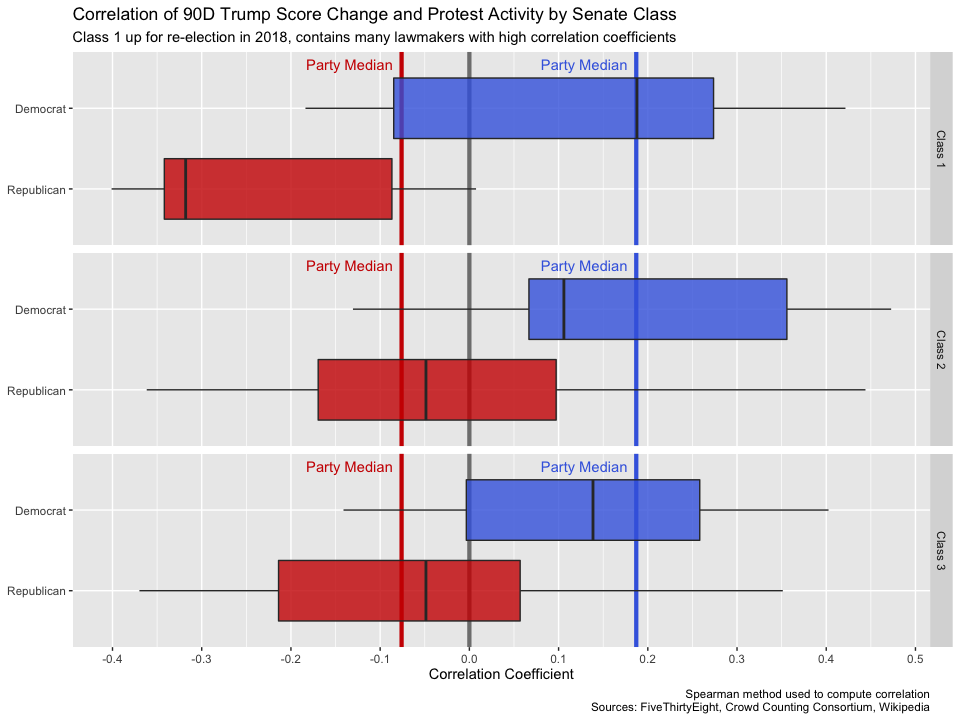<!-- -->

It is difficult to draw sweeping conclusions given the small number of
senators in each class, but it seems like the senators in class 1, which
was up for re-election in 2018, had a relatively large number of
senators who were highly likely to compromise following increased
protest activity. This could strengthen the argument that lawmakers
prefer the optics of compromise when faced with an upcoming election.

## Conclusion

Despite our best efforts, we found that in general, protest attendance
was not a very good indicator of senators’ resistance to Trumpian
policies. More than anything, it is just a weak proxy for the general
political attitudes of a state which is a stronger indicator of Trump
scores along with party affiliation.

In fact, on the contrary, it is possible that protests are a (fairly
noisy) indicator that lawmakers are more likely to seek compromise in
the short-term as opposed to a long-term resistance. It is unclear what
if any causality exists here; it might be a sign that senators up for
re-election were seeking to project a particular image in the name of
winning their election. The evidence for this link is weak, though, and
requires more investigation in any case.

But if you’re a citizen that feels passionately about stopping Donald
Trump’s policy agenda in general, you’re probably better off waiting for
election day and getting to the polls rather than taking to the streets.

### Footnotes

1.  [Gambino and
    Gabbatt, 2017](https://www.theguardian.com/us-news/2017/feb/19/democrats-resistance-donald-trump-we-will-replace-you)

2.  [Miras, N.S. (2019), Polls and Elections: Resistance Is Not Futile:
    Anti‐Trump Protest and Senators’ Opposition to President Trump in
    the 115th Congress. Presidential Studies Quarterly, 49: 932-958.
    doi:10.1111/psq.12575](https://onlinelibrary.wiley.com/doi/full/10.1111/psq.12575)

3.  In some cases, they provide a single value as an estimate, and in
    others, they provide a range. In the cases where they provide a
    range, we imputed the single-value estimate with the geometric mean
    of the endpoints of the range.

4.  See
    [Wikipedia](https://en.wikipedia.org/wiki/Moving_average#Exponential_moving_average)
    for details. We use a decay factor (α) of 0.05, though the exact
    value should not be of much consequence for the purposes of our
    analysis.

5.  We use the spearman method instead of the usual pearson method
    because it is more robust to outliers and non-linear relationships.
