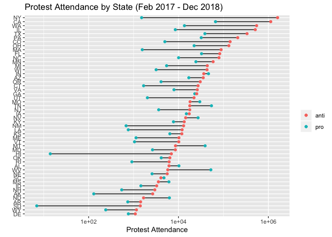
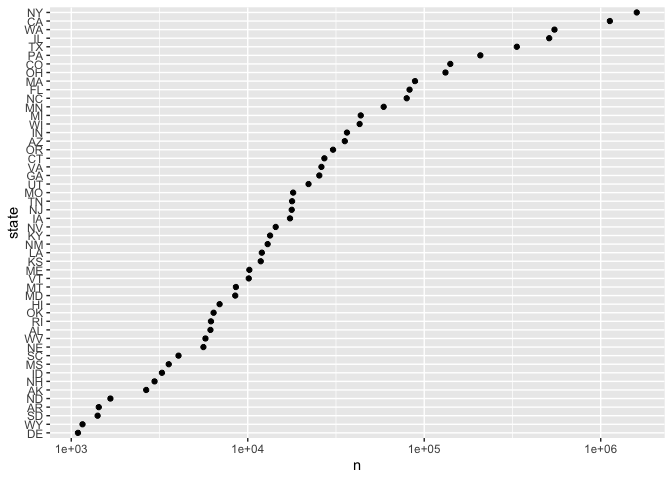
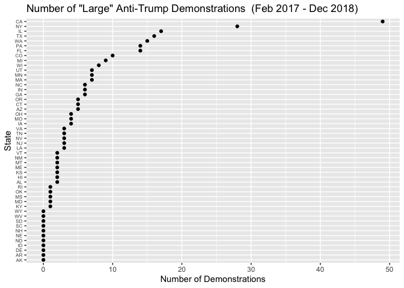

Protests
================
Mac Bagwell
2020-02-24

``` r
# Libraries
library(tidyverse)
library(lubridate)

# Parameters
protests_file <- here::here("c01-own/data/protests.rds")
#===============================================================================

# Code
protests <- read_rds(protests_file)
```

## Which States have the Most Protests?

Unsurprisingly, California and New York top the list of states with the
most Anti-Trump demonstrations. The next two states are surprising;
Florida and Texas. This could just be a function of the number of people
living in these states.

``` r
protests %>% 
  count(state, pro_anti_trump, wt = attendance) %>% 
  filter(pro_anti_trump != "neutral") %>% 
  select(state, pro_anti_trump, n) %>% 
  pivot_wider(
    names_from = pro_anti_trump,
    values_from = n
  ) %>% 
  mutate(state = fct_reorder(state, anti)) %>% 
  ggplot(aes(x = state)) +
  geom_segment(aes(xend = state, y = pro, yend = anti)) +
  geom_point(aes(y = pro, color = "pro")) +
  geom_point(aes(y = anti, color = "anti")) +
  scale_y_log10() +
  coord_flip() +
  labs(
    title = "Protest Attendance by State (Feb 2017 - Dec 2018)",
    x = "",
    y = "Protest Attendance",
    color = ""
  ) +
  ggsave("figures/protest_by_state.png")
```

    ## Saving 7 x 5 in image

<!-- -->

Another thing to note is that Anti-Trump demonstrations are far more
common across the board than Pro-Trump demonstrations. This stands to
reason, as those unsupportive of Trump have less to complain about than
those supportive of Trump. However, this could also be affected by bias
in the data collection. The CCC is a group run and operated by academic
figures, such as professors and grad students, and collects its data at
least partially through user-submitted reports. It is plausible that
reporting comes largely from other people in academia, who are known to
lean left generally and who may have more knowledge of Anti-Trump
demonstrations than Pro-Trump demonstrations.

As much as possible, analysis should focus on Anti-Trump demonstrations,
since data for these are more abundant. We should also probably scale
demonstration counts to population of the state.

``` r
protests %>% 
  filter(pro_anti_trump == "anti") %>%
  count(state, wt = attendance) %>% 
  mutate(state = fct_reorder(state, n)) %>% 
  ggplot(aes(state, n)) +
  geom_point() +
  coord_flip() +
  scale_y_log10()
```

<!-- -->

Miras elects to use “large protests”, defined as protests whose
attendance was at least 1000 people, as a measurement of anti-Trump
sentiment. Below, we plot the number of large Anti-Trump protests by
state in the dataset. Such protests are fairly uncommon, so we see a
stratified graph. These also correlates pretty well with population.

``` r
protests %>% 
  filter(pro_anti_trump == "anti") %>% 
  count(state, wt = attendance > 1000) %>% 
  mutate(state = state %>% fct_reorder(n)) %>% 
  ggplot(aes(state, n)) +
  geom_point() +
  coord_flip() +
  theme(axis.text.y = element_text(size = 6)) +
  labs(
    title = "Number of \"Large\" Anti-Trump Demonstrations  (Feb 2017 - Dec 2018)",
    x = "State",
    y = "Number of Demonstrations"
  ) +
  ggsave("figures/protest_large_demonstrations.png")
```

    ## Saving 7 x 5 in image

<!-- -->
