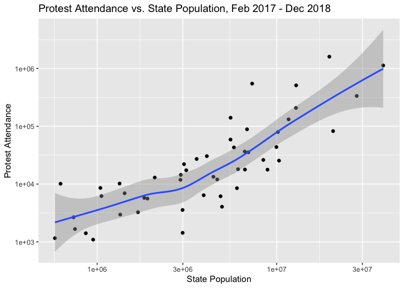
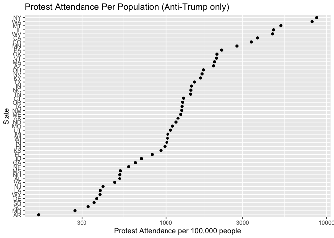
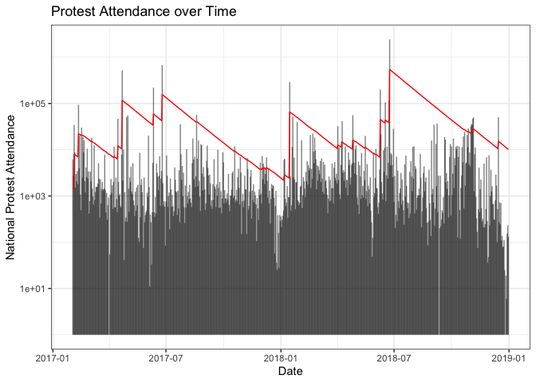

Population-Adjusted Protest Data
================
Mac Bagwell
2020-02-24

  - [Population Adjusted Protest Attendance
    2017-18](#population-adjusted-protest-attendance-2017-18)

``` r
# Libraries
library(tidyverse)
library(lubridate)

# Parameters
protests_population_file <- here::here("c01-own/data/protests_population.rds")

#===============================================================================

# Code
protests_population <- read_rds(protests_population_file)
```

## Population Adjusted Protest Attendance 2017-18

As we did before, we reduce the estimates data to one point estimate
depending on whether a point estimate is provided or a range is
provided.

``` r
protests_population %>% 
  filter(pro_anti_trump == "anti") %>% 
  count(state, population, wt = attendance) %>%  
  ggplot(aes(population, n)) +
  geom_point() +
  geom_smooth(method = "loess") +
  scale_x_log10() +
  scale_y_log10() +
  labs(
    title = "Protest Attendance vs. State Population, Feb 2017 - Dec 2018",
    x = "State Population",
    y = "Protest Attendance"
  ) +
  ggsave("figures/protest_vs_population.png")
```

    ## Saving 7 x 5 in image

<!-- -->

Proportional to population, New York was actually the most active
Anti-Trump protest state, and California was actually less active than
states like Conneticut, Massachussetts, and Washington. This differs
from the perspective given by Miras’ measure of “large protests”.

There is still significant variation in protest activity against Trump
that isn’t explained by differing populations. I would think that
Trump’s performance in each state in 2016 probably explains a lot of
this variation.

``` r
protests_population %>% 
  count(state, wt = attendance / (population / 1e5)) %>% 
  mutate(state = state %>% fct_reorder(n)) %>% 
  ggplot(aes(state, n)) +
  geom_point() +
  scale_y_log10() +
  coord_flip() +
  labs(
    title = "Protest Attendance Per Population (Anti-Trump only)",
    x = "State",
    y = "Protest Attendance per 100,000 people"
  ) +
  ggsave("figures/protest_per_population_by_state.png")
```

    ## Saving 7 x 5 in image

<!-- -->

``` r
ewma <- function(x, lambda) {
    p <- 0
  if_else(!is.finite(x), 0, x) %>% 
      map_dbl(
        ~ (p <<- p * lambda + (. ^ 2) * (1 - lambda))
       ) %>% 
    sqrt()
}

protests_population %>% 
  count(
    date = floor_date(date, unit = "day"), 
    wt = attendance,
    name = "attendance"
  ) %>% 
  mutate(
    ewma_attendance = ewma(attendance, lambda = 0.95)
  ) %>% 
  ggplot(aes(date)) +
  geom_segment(aes(xend = date, y = 1, yend = 1 + attendance), alpha = 0.5) +
  geom_line(aes(y = 1 + ewma_attendance), color = "red") +
  scale_y_log10() +
  labs(
    title = "Protest Attendance over Time",
    x = "Date",
    y = "National Protest Attendance"
  ) +
  theme_bw() +
  ggsave("figures/protest_vs_time.png")
```

    ## Saving 7 x 5 in image

<!-- -->
