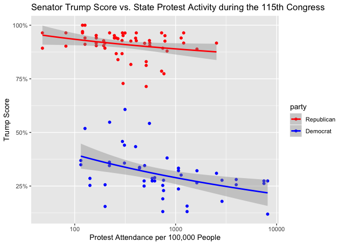
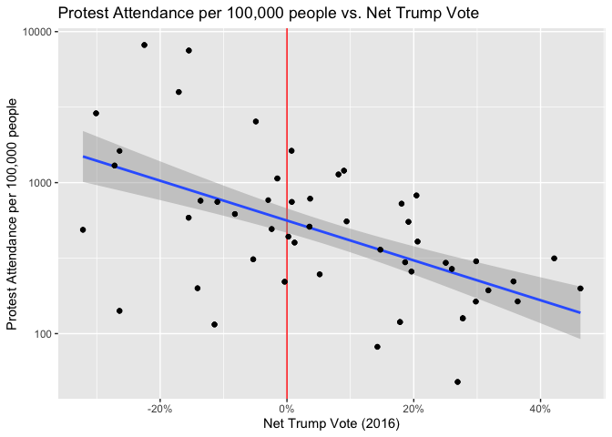
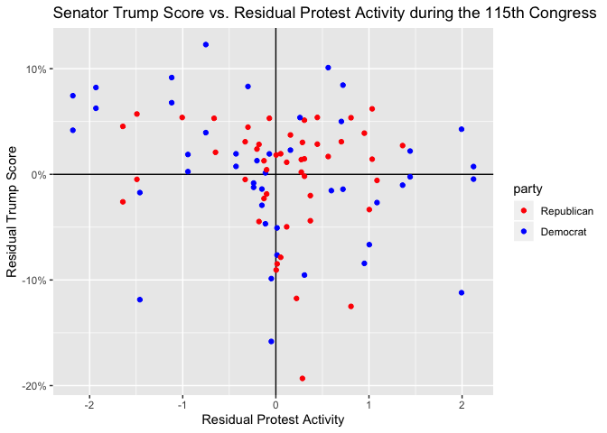
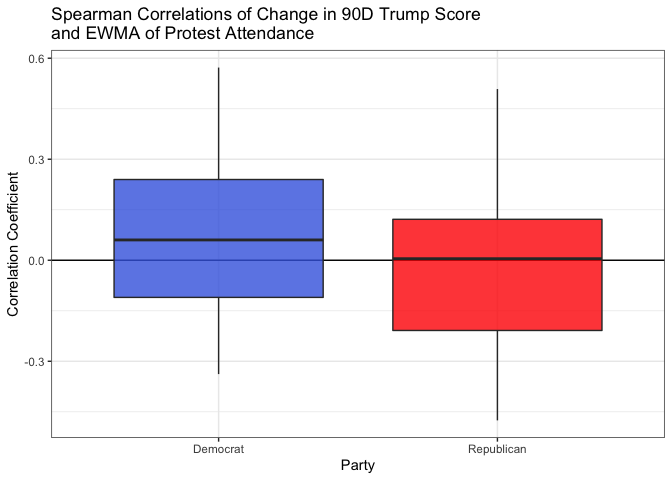
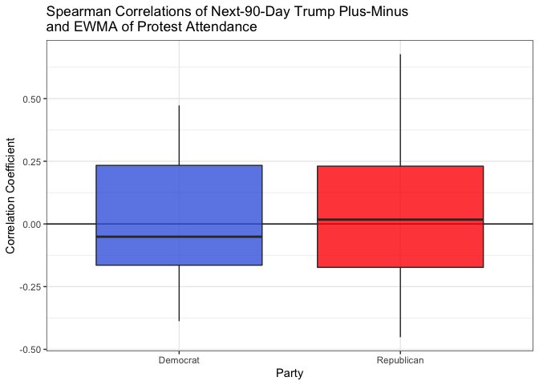

Relating Protest Attendance and Senator Trump Score
================
Mac Bagwell
2020-02-26

  - [Recreating Miras’ Plot](#recreating-miras-plot)
  - [Correlation Between Protest Activity and Trump’s
    Performance](#correlation-between-protest-activity-and-trumps-performance)
  - [Correlation Between Protest Attendance and Trump
    Score](#correlation-between-protest-attendance-and-trump-score)

``` r
# Libraries
library(tidyverse)
library(lubridate)
library(modelr)

# Parameters
WINDOW <- 90
LAMBDA <- 0.95

protest_file <- here::here("c01-own/data/protests_population.rds")
member_averages_file <- here::here("c01-own/data/member_averages.rds")
votes_file <- here::here("c01-own/data/votes.rds")
#===============================================================================

# Code
ewma <- function(x, lambda) {
    p <- 0
  if_else(!is.finite(x), 0, x) %>% 
      map_dbl(
        ~ (p <<- p * lambda + (. ^ 2) * (1 - lambda))
       ) %>% 
    sqrt()
}

protest_trump_plot <- function(state_) {
  state_plot <- 
    cowplot::plot_grid(
      state_protests %>% 
        filter(state == state_) %>% 
        ggplot(aes(date, 1 + protest_attendance)) +
        geom_line() +
        scale_x_date(date_breaks = "3 months") +
        scale_y_log10() +
        labs(
          title = 
            str_c(
              state_, 
              str_glue("EWMA Protest Attendance"), 
              sep = " "
            ),
          x = "Date",
          y = "Protest Attendance per 100,000 People"
        ),
      senators %>% 
        filter(state == state_) %>% 
        ggplot(aes(date, trump_score, color = last_name)) +
        geom_line() +
        scale_x_date(date_breaks = "3 months") +
        scale_y_continuous(breaks = seq(0, 1, by = 0.25)) +
        theme(legend.position = "bottom") +
        labs(
          title = str_c(state_, str_glue("Senator Trump Score, Next {WINDOW} Days"), sep = " "),
          x = "Date",
          y = "Trump Score",
          color = "Senator"
        ),
      nrow = 2
    )
  
  state_plot +
    ggsave(
      str_glue("c01-own/eda/figures/{state_}_ts.png") %>% 
        here::here()
    )
  
  state_plot
}

protest_trump_scatter <- function(state_) {
  state_protests %>% 
    filter(state == state_) %>% 
    left_join(senators %>% filter(state == state_), by = c("date", "state")) %>% 
    drop_na(last_name, protest_attendance, trump_score) %>% 
    group_by(bioguide) %>% 
    ggplot(aes(protest_attendance, trump_score, color = as.integer(date))) +
    geom_jitter() +
    scale_x_log10() +
    scale_color_viridis_c(
      labels = function(x) as.Date(x, origin = "1970-01-01")
    ) +
    facet_wrap(vars(last_name)) +
    theme(legend.position = "bottom") +
    labs(
      title = 
        str_c(
          state_, 
          str_glue("Senator Trump Score (Next {WINDOW} days) vs. Protest Attendance"), 
          sep = " "
        ),
      x = "EWMA Protest Attendance",
      y = "Trump Score",
      color = "Date"
    ) +
    ggsave(
      str_glue("c01-own/eda/figures/{state_}_scatter.png") %>% 
        here::here()
    )
}

protest_population <- read_rds(protest_file) %>% filter(pro_anti_trump == "anti")
member_averages <- read_rds(member_averages_file) %>% filter(congress == 115L)
votes <- read_rds(votes_file) 

state_protests <- 
  tibble(
    date = 
      seq(ymd("2017-02-02"), ymd("2018-12-31"), by = "1 day") %>% as.Date()
  ) %>% 
  left_join(
    protest_population %>% 
      count(state, date = as.Date(date), wt =  attendance / (population / 1e5)) %>% 
      pivot_wider(
        names_from = state,
        values_from = n,
        values_fill = list(n = 0L)
      ),
    by = "date"
  ) %>% 
  mutate_at(
    vars(-date),
    ewma,
    lambda = LAMBDA
  ) %>%
  pivot_longer(
    cols = -date,
    names_to = "state",
    values_to = "protest_attendance"
  )

senators <- 
  tibble(
    date = 
      seq(ymd("2017-02-02"), ymd("2018-12-31"), by = "1 day") %>% as.Date()
  ) %>% 
  left_join(
    votes %>% 
      semi_join(
        member_averages %>% 
          filter(congress == 115L, votes >= 80, party != "Independent"),
        by = "bioguide"
      ) %>% 
      mutate(date = as.Date(voted_at)) %>% 
      group_by(date, bioguide, last_name, state, party) %>% 
      summarize(
        agrees = sum(agree),
        predicted = sum(predicted_probability),
        votes = n()
      ) %>% 
      pivot_wider(
        names_from = c(bioguide, last_name, state, party),
        values_from = c(agrees, predicted, votes)
      ),
    by = "date"
  ) %>% 
  replace_na(list(agrees = 0L, predicted = 0L, votes = 0L)) %>% 
  mutate_at(
    vars(
      starts_with("agrees"), 
      starts_with("predicted"), 
      starts_with("votes")
    ),
    list(
      forward = 
        ~ RcppRoll::roll_suml(., n = WINDOW, fill = NA_integer_, na.rm = TRUE),
      past = 
        ~ lag(.) %>% 
          RcppRoll::roll_sumr(., n = WINDOW, fill = NA_integer_, na.rm = TRUE)
    )
  ) %>% 
  select(date, ends_with("forward"), ends_with("past")) %>% 
  pivot_longer(
    cols = -date,
    names_to = c("variable", "bioguide", "last_name", "state", "party", "window"),
    names_sep = "_",
    values_to = "value"
  ) %>% 
  pivot_wider(
    names_from = c(variable, window),
    values_from = value
  ) %>%
  mutate(
    trump_score_forward = agrees_forward / votes_forward,
    predicted_trump_score_forward = predicted_forward / votes_forward,
    trump_score_past = agrees_past / votes_past,
    predicted_trump_score_past = predicted_past / votes_past,
    trump_score_diff = trump_score_forward - trump_score_past,
    predicted_trump_score_diff = 
      predicted_trump_score_forward - predicted_trump_score_past,
    last_name = 
      str_c(
        last_name,
        case_when(
          party == "Republican" ~ str_glue("(R-{state})"),
          party == "Democrat" ~ str_glue("(D-{state})"),
          party == "Independent" ~ str_glue("(I-{state})"),
          TRUE ~ "(Other)"
        ),
        sep = " "
      )
  )
```

## Recreating Miras’ Plot

Below we recreate a slightly different version of Miras’ plot. The
x-axis is the log of total anti-Trump protest attendance during the
115th session of congress by senators’ state scaled by population, and
the y-axis is the “Trump Score” of the senator. We see a negative
correlation between the two for the Democrats, and a weaker such trend
for Republicans. But this could easily be attributed to the relative
political tastes of the constituencies, and protests need not have any
causal relationship with Senatorial legilative activity.

``` r
protest_population %>% 
  count(
    state, 
    name = "protest_activity", 
    wt = attendance / (population / 1e5)
  ) %>% 
  left_join(
    member_averages %>%
      select(state, party, agree_pct, votes) %>% 
      filter(party != "Independent"),
    by = "state"
  ) %>% 
  ggplot(aes(protest_activity, agree_pct, color = party)) +
  geom_point() +
  geom_smooth(method = "lm", formula = y ~ log(x)) +
  scale_color_manual(
    breaks = c("Republican", "Democrat"),
    values = c("red", "blue")
  ) +
  scale_x_log10() +
  scale_y_continuous(
    labels = scales::label_percent()
  ) +
  labs(
    title = "Senator Trump Score vs. State Protest Activity during the 115th Congress",
    x = "Protest Attendance per 100,000 People",
    y = "Trump Score"
  ) +
  ggsave(
    "c01-own/eda/figures/miras.png" %>% 
      here::here()
  )
```

    ## Saving 7 x 5 in image

<!-- -->

## Correlation Between Protest Activity and Trump’s Performance

As suspected, Trump’s performance is somewhat correlated with protest
activity in that state. We ought to control for this before considering
the effect of protests on senators.

``` r
protest_trump_state <- 
  protest_population %>% 
  count(
    state, 
    name = "protest_activity", 
    wt = attendance / (population / 1e5)
  ) %>% 
  left_join(
    member_averages %>%
      filter(congress == 115L, party != "Independent") %>% 
      select(state, net_trump_vote, party, agree_pct),
    by = "state"
  )

protest_trump_state %>% 
  ggplot(aes(net_trump_vote, protest_activity)) +
  geom_vline(xintercept = 0, color = "red") +
  geom_smooth(method = "lm") +
  geom_point() +
  scale_x_continuous(
    labels = scales::label_percent(scale = 1)
  ) +
  scale_y_log10() +
  labs(
    title = "Protest Attendance per 100,000 people vs. Net Trump Vote",
    x = "Net Trump Vote (2016)",
    y = "Protest Attendance per 100,000 people"
  ) +
  ggsave("figures/protest_vs_net_trump_vote.png")
```

    ## Saving 7 x 5 in image

<!-- -->

``` r
protest_trump_mod <- 
  protest_trump_state %>% 
  fit_with(
    lm, 
    list(
      protest = log(protest_activity) ~ net_trump_vote,
      trump = agree_pct ~ net_trump_vote * party
    )
  )

protest_population %>% 
  count(
    state, 
    name = "protest_activity", 
    wt = attendance / (population / 1e5)
  ) %>% 
  left_join(
    member_averages %>%
      select(state, party, agree_pct, net_trump_vote, votes) %>% 
      filter(party != "Independent", votes >= 80),
    by = "state"
  ) %>% 
  spread_residuals(!!! protest_trump_mod) %>% 
  ggplot(aes(protest, trump, color = party)) +
  geom_hline(yintercept = 0) +
  geom_vline(xintercept = 0) +
  geom_point() +
  scale_color_manual(
    breaks = c("Republican", "Democrat"),
    values = c("red", "blue")
  ) +
  scale_y_continuous(
    labels = scales::label_percent()
  ) +
  labs(
    title = "Senator Trump Score vs. Residual Protest Activity during the 115th Congress",
    x = "Residual Protest Activity",
    y = "Residual Trump Score"
  ) +
  ggsave(
    "c01-own/eda/figures/miras-resid.png" %>% 
      here::here()
  )
```

    ## Saving 7 x 5 in image

<!-- -->

## Correlation Between Protest Attendance and Trump Score

Preliminary looks at the time series relationship between state’s
protest attendance and senators’ Trump Scores don’t reveal any patterns,
contrary to Miras’ findngs. We would expect to find that Trump Score
goes down as protest activity increases, However, looking at some of the
time series plots does not sugg

``` r
map(state.abb, protest_trump_plot)
```

``` r
map(state.abb, protest_trump_scatter)
```

``` r
corrs <- 
  state_protests %>% 
  left_join(
    senators %>% 
      semi_join(
        member_averages %>% 
          filter(congress == 115, votes > 80),
        by = "bioguide"
      ), 
    by = c("date", "state")
  ) %>% 
  filter(date >= "2017-02-16", party != "Independent") %>% 
  group_by(bioguide, last_name, party, state) %>% 
  summarize(r = cor(log(protest_attendance), trump_score_diff, method = "spearman", use = "pair")) %>% 
  ungroup()

corrs %>% 
  ggplot(aes(party, r, fill = party)) +
  geom_hline(yintercept = 0) +
  geom_boxplot(alpha = 0.8) +
  scale_fill_manual(
    breaks = c("Democrat", "Republican"),
    values = c("royalblue", "red")
  ) + 
  theme_bw() +
  theme(legend.position = "none") +
  labs(
    title = str_glue("Spearman Correlations of Change in {WINDOW}D Trump Score\nand EWMA of Protest Attendance"),
    x = "Party",
    y = "Correlation Coefficient"
  ) +
  ggsave("figures/trump_score_protest_spearman.png")
```

    ## Saving 7 x 5 in image

<!-- -->

``` r
pm_corrs <- 
  state_protests %>% 
  left_join(
    senators %>% 
      semi_join(
        member_averages %>% 
          filter(congress == 115, votes > 80),
        by = "bioguide"
      ), 
    by = c("date", "state")
  ) %>% 
  filter(date >= "2017-02-16", party != "Independent") %>% 
  group_by(bioguide, last_name, party, state) %>% 
  summarize(
    r = 
      cor(
        log(protest_attendance), 
        trump_score_diff - predicted_trump_score_diff, 
        method = "spearman",
        use = "pair"
      )
  ) %>% 
  ungroup()

pm_corrs %>% 
  ggplot(aes(party, r, fill = party)) +
  geom_hline(yintercept = 0) +
  geom_boxplot(alpha = 0.8) +
  scale_fill_manual(
    breaks = c("Democrat", "Republican"),
    values = c("royalblue", "red")
  ) + 
  theme_bw() +
  theme(legend.position = "none") +
  labs(
    title = str_glue("Spearman Correlations of Next-{WINDOW}-Day Trump Plus-Minus\nand EWMA of Protest Attendance"),
    x = "Party",
    y = "Correlation Coefficient"
  ) +
  ggsave("figures/trump_pm_protest_spearman.png")
```

    ## Saving 7 x 5 in image

<!-- -->
